# Esquemático de Conexão Elétrica: ESP32 DevKit V1 (30 Pinos) + ST7789 + BH1750 + LED

Documento atualizado com base no modelo físico real da sua placa **ESP32 DevKit V1 (30 pinos, chip CH9102X)** e na **Protoboard de 830 pontos** (linhas 1 a 60, colunas A-E e F-J).

---

## 1. Pinagem Real da sua Placa ESP32 (Serigrafia Fiel à Imagem)

Com o conector **Micro-USB voltado para a esquerda**:

```text
       +-----------------------------------------------------------------------+
       | [EN]    (Chip CH9102X)                      [ESP-WROOM-32 Antena]     |
[USB]  |                                                                       |
       | [BOOT]                                                                |
       +-----------------------------------------------------------------------+

FILEIRA SUPERIOR (Pinos 1 a 15, da esquerda para a direita):
 [ 1] VIN  -> Entrada 5V do USB (Não usar para periféricos 3.3V)
 [ 2] GND  -> Linha Azul (-) da Protoboard
 [ 3] D13  -> Livre
 [ 4] D12  -> LED de Alerta (+ Resistor 220Ω/330Ω)
 [ 5] D14  -> Livre (Reservado para Relé/Buzzer se desejar)
 [ 6] D27  -> Livre
 [ 7] D26  -> Livre
 [ 8] D25  -> Livre
 [ 9] D33  -> Livre
 [10] D32  -> Livre
 [11] D35  -> Livre
 [12] D34  -> Livre (Sensor Som/Analógico futuro)
 [13] VN   -> Livre (GPIO 39)
 [14] VP   -> Livre (GPIO 36)
 [15] EN   -> Botão Reset

FILEIRA INFERIOR (Pinos 1 a 15, da esquerda para a direita):
 [ 1] 3V3  -> Linha Vermelha (+) da Protoboard (Alimentação 3.3V)
 [ 2] GND  -> Linha Azul (-) da Protoboard (Terra comum)
 [ 3] D15  -> Sensor Temp/Umidade (DATA) - Ponto de Espera
 [ 4] D2   -> Display TFT (Pino DC / RS)
 [ 5] D4   -> Display TFT (Pino RES / RST)
 [ 6] RX2  -> Livre (GPIO 16)
 [ 7] TX2  -> Livre (GPIO 17)
 [ 8] D5   -> Display TFT (Pino CS)
 [ 9] D18  -> Display TFT (Pino SCL / Clock)
 [10] D19  -> Livre
 [11] D21  -> Sensor BH1750 (Pino SDA)
 [12] RX0  -> Livre (GPIO 3)
 [13] TX0  -> Livre (GPIO 1)
 [14] D22  -> Sensor BH1750 (Pino SCL)
 [15] D23  -> Display TFT (Pino SDA / MOSI)
```

---

## 2. Tabela de Ligação dos Componentes

| Periférico | Pino no Módulo | Pino Impresso no ESP32 | Linha Sugerida na Protoboard | Observação |
| :--- | :---: | :---: | :---: | :--- |
| **Alimentação ESP32** | — | **3V3** (Inf. pino 1) | Linha 1 | Jumper para o barramento **Vermelho (+)** |
| | — | **GND** (Inf. pino 2) | Linha 2 | Jumper para o barramento **Azul (-)** |
| **Display TFT 2.25"** | **GND** | **GND** | Barramento Azul | Terra comum |
| | **VCC** | **3V3** | Barramento Vermelho | Lógica e alimentação 3.3V |
| | **SCL** | **D18** (Inf. pino 9) | Linha 9 | Hardware SPI Clock |
| | **SDA** | **D23** (Inf. pino 15)| Linha 15 | Hardware SPI Data (MOSI) |
| | **RES** | **D4** (Inf. pino 5)  | Linha 5 | Hardware Reset |
| | **DC** | **D2** (Inf. pino 4)  | Linha 4 | Seleção Dados / Comando |
| | **CS** | **D5** (Inf. pino 8)  | Linha 8 | Chip Select |
| | **BL** | **GND** | Barramento Azul | Conectar ao **GND** para acender luz de fundo |
| **Sensor Luz (BH1750)**| **VCC** | **3V3** | Barramento Vermelho | Alimentação 3.3V segura |
| | **GND** | **GND** | Barramento Azul | Terra comum |
| | **SDA** | **D21** (Inf. pino 11)| Linha 11 | Barramento Hardware I2C SDA |
| | **SCL** | **D22** (Inf. pino 14)| Linha 14 | Barramento Hardware I2C SCL |
| | **ADDR**| *(Livre ou GND)* | — | Define endereço `0x23` |
| **LED de Alerta (Kit)**| **Ânodo (+)**| **D12** (Sup. pino 4)| Linha 4 (lado sup.) | Em série com **Resistor de 220Ω ou 330Ω** |
| | **Cátodo (-)**| **GND** | Barramento Azul | Perna curta conectada diretamente ao GND |
| **Sensor Temp/Umid** *(Aguard.)* | **DATA** | **D15** (Inf. pino 3) | Linha 3 | Reservado para DHT22 / DHT11 |
| | **VCC** | **3V3** | Barramento Vermelho | Linha de espera |
| | **GND** | **GND** | Barramento Azul | Linha de espera |

---

## 3. Guia de Posicionamento na Protoboard de 830 Pontos

A protoboard possui o canal central divisor e duas seções de 5 furos: **A-B-C-D-E** e **F-G-H-I-J**, numeradas de 1 a 60.

1. **Posicionamento do ESP32**:
   - Encaixe o ESP32 transpassando a canaleta central entre as **Linhas 1 e 15**.
   - Coloque a porta Micro-USB alinhada com a borda externa (Linha 1).
   - A fileira inferior (**3V3** até **D23**) fica nas colunas **E** (linhas 1 a 15), deixando as colunas **A, B, C, D** livres para os jumpers.
   - A fileira superior (**VIN** até **EN**) fica nas colunas **F** (linhas 1 a 15), deixando as colunas **G, H, I, J** livres para os jumpers.

2. **Posicionamento dos Sensores e Display**:
   - Utilize a área das **Linhas 25 a 45** da protoboard para espetar o sensor BH1750, o LED com seu resistor e a espera do sensor de temperatura.
   - O Display TFT 2.25" pode ser espetado diretamente na protoboard ou conectado por jumpers macho-fêmea caso prefira deixá-lo inclinado para visualização.

---

## 4. Guia e Especificação de Resistores

| Componente | Precisa de Resistor? | Valor Recomendado | Código de Cores (Kit) | Onde e Como Ligar |
| :--- | :---: | :---: | :---: | :--- |
| **LED de Alerta** | **SIM (Obrigatório)** | **220 Ω a 470 Ω** *(460 Ω OK)* | **220Ω:** Vermelho - Vermelho - Marrom<br>**330Ω:** Laranja - Laranja - Marrom<br>**470Ω:** Amarelo - Violeta - Marrom | Em série entre o pino **D12** e o **Ânodo (+)** do LED. |
| **Display TFT 2.25"** | **NÃO** | — | — | Conexão direta aos pinos (3.3V nativo). |
| **Sensor BH1750** | **NÃO** | — | — | Conexão direta. A plaquinha GY-302 já possui pull-ups I2C. |
| **Sensor Temp/Umid** *(Aguardando)* | **DEPENDE** | **4.7 kΩ** ou **10 kΩ** | **10kΩ:** Marrom - Preto - Laranja | Se vier em módulo com placa: não precisa. Se vier sensor solto de 4 pinos: 1 resistor entre 3V3 e D15. |

---

## 5. Diagrama Visual de Conexões Elétricas (Mermaid)

```mermaid
flowchart TD
    subgraph ALIMENTACAO["Barramento de Alimentacao (Protoboard)"]
        RAIL_3V3["Linha Vermelha (+ 3.3V)"]
        RAIL_GND["Linha Azul (- GND)"]
    end

    subgraph SHIELD_ESQ["ESP32 Shield - Lado Esquerdo"]
        D12["Pino D12"]
        D14["Pino D14 (Atuador/Buzzer)"]
        D32["Pino D32 (TFT Backlight)"]
        D34["Pino D34 (ADC Som)"]
    end

    subgraph SHIELD_DIR["ESP32 Shield - Lado Direito"]
        PIN_3V3["Pino 3V3"]
        PIN_GND["Pino GND"]
        D15["Pino D15 (DHT Data)"]
        D2["Pino D2 (TFT DC)"]
        D4["Pino D4 (TFT RES)"]
        D5["Pino D5 (TFT CS)"]
        D18["Pino D18 (TFT SCL)"]
        D21["Pino D21 (I2C SDA)"]
        D22["Pino D22 (I2C SCL)"]
        D23["Pino D23 (TFT SDA/MOSI)"]
    end

    %% Energizacao dos Barramentos
    PIN_3V3 ==>|Jumper Vermelho| RAIL_3V3
    PIN_GND ==>|Jumper Azul/Preto| RAIL_GND

    %% Circuito do LED de Alerta
    subgraph CIRCUITO_LED["Circuito do LED"]
        RES["Resistor 220R / 330R / 460R-470R"]
        LED_POS["LED: Anodo (+) / Perna Longa"]
        LED_NEG["LED: Catodo (-) / Perna Curta"]
    end
    D12 --> RES
    RES --> LED_POS
    LED_NEG --> RAIL_GND

    %% Sensor DHT22 / Temp & Umidade
    subgraph MOD_DHT["Sensor Temp/Umid (DHT22)"]
        DHT_VCC["VCC (+)"]
        DHT_DATA["DATA (Sinal)"]
        DHT_GND["GND (-)"]
    end
    RAIL_3V3 --> DHT_VCC
    RAIL_GND --> DHT_GND
    DHT_DATA --> D15

    %% Sensor de Ruido / Som (Analogico)
    subgraph MOD_SOM["Sensor de Som (KY-038 / LM393)"]
        SOM_VCC["VCC (+)"]
        SOM_AO["AO (Saida Analogica)"]
        SOM_GND["GND (-)"]
    end
    RAIL_3V3 --> SOM_VCC
    RAIL_GND --> SOM_GND
    SOM_AO --> D34

    %% Display TFT ST7789
    subgraph MOD_TFT["Display TFT ST7789 (SPI)"]
        TFT_VCC["VCC (+)"]
        TFT_GND["GND (-)"]
        TFT_SCL["SCL (Clock)"]
        TFT_SDA["SDA (MOSI)"]
        TFT_RES["RES (Reset)"]
        TFT_DC["DC (Data/Cmd)"]
        TFT_CS["CS (Chip Select)"]
        TFT_BL["BL (Luz de Fundo)"]
    end
    RAIL_3V3 --> TFT_VCC
    RAIL_GND --> TFT_GND
    D18 --> TFT_SCL
    D23 --> TFT_SDA
    D4 --> TFT_RES
    D2 --> TFT_DC
    D5 --> TFT_CS
    D32 --> TFT_BL

    %% Sensor BH1750 (Luz I2C - Opcional)
    subgraph MOD_BH1750["Sensor de Luz (BH1750 I2C)"]
        BH_VCC["VCC (+)"]
        BH_GND["GND (-)"]
        BH_SDA["SDA"]
        BH_SCL["SCL"]
    end
    RAIL_3V3 -.-> BH_VCC
    RAIL_GND -.-> BH_GND
    D21 -.-> BH_SDA
    D22 -.-> BH_SCL
```



---

## 6. Diretivas Normativas de Saúde e Classificação de Luminosidade (Lux)

Com base nas normas técnicas de ergonomia e higiene ocupacional:
- **ABNT NBR ISO/CIE 8995-1** (Iluminação de Ambientes de Trabalho - Parte 1: Interior)
- **NHO 11 da FUNDACENTRO** (Avaliação dos Níveis de Iluminamento em Ambientes de Trabalho)
- **NR-17** (Ergonomia e Conforto Visual no Trabalho)

O valor numérico em **Lux (lx)** lido pelo sensor BH1750 é mantido no painel e classificado dinamicamente nas seguintes faixas:

| Faixa (Lux) | Classificação do Ambiente | Impacto na Saúde Visual (Ergonomia) | Indicação no Dashboard |
| :--- | :--- | :--- | :--- |
| **< 100 lx** | **Muito Baixo (Crítico / Penumbra)** | Risco severo de fadiga visual (*astenopia*), sonolência e dores de cabeça. Inadequado para leitura ou tela. | 🔴 Muito Baixo (<100 lx): Insuficiente / Risco de Fadiga Ocular |
| **100 a 299 lx** | **Baixo (Áreas de Circulação)** | Aceitável para corredores, depósitos ou relaxamento, mas insuficiente para estudo contínuo. | ⚠️ Baixo (100-300 lx): Circulação / Fraco p/ Trabalho (NHO 11) |
| **300 a 750 lx** | **Ideal (Conforto Normativo)** | **Faixa preconizada pela NBR 8995-1** para escritórios, salas de aula e uso de computadores. Máximo rendimento sem esforço. | ✅ Ideal (300-750 lx): Conforto Visual Normativo (NBR 8995-1) |
| **751 a 1500 lx** | **Alto (Tarefas de Precisão)** | Iluminação intensa. Excelente para eletrônica fina, montagem mecânica ou desenho técnico. | 💡 Alto (750-1500 lx): Adequado p/ Tarefas de Alta Precisão |
| **> 1500 lx** | **Excessivo (Risco de Ofuscamento)** | Acima do necessário para interiores. Pode causar ofuscamento (*glare*), reflexos incômodos e cefaleia. | ⚡ Excessivo (>1500 lx): Acima do Necessário / Ofuscamento |

