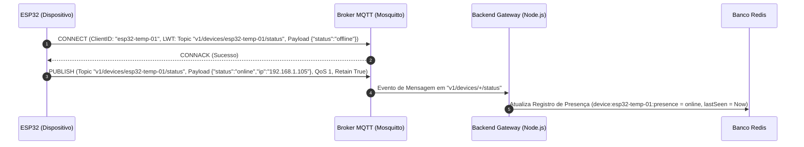
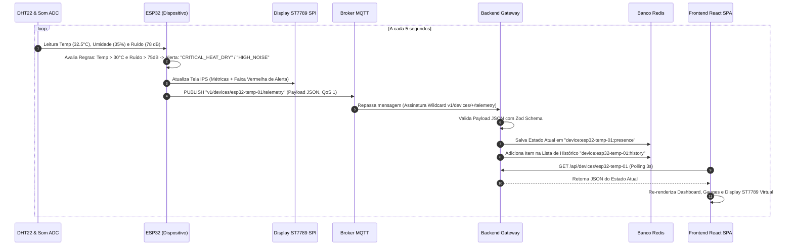
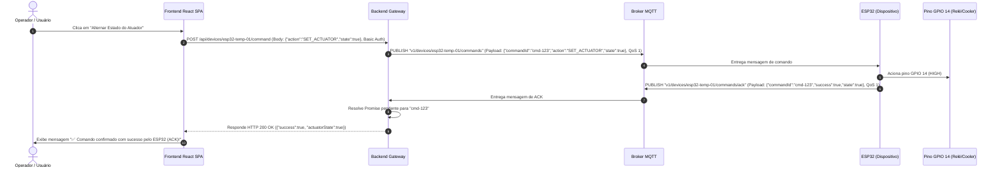

# Documentação do Fluxo de Dados e Mensagens - Entrega 1

Este documento especifica os fluxos de dados, tópicos MQTT, estrutura de payloads JSON, níveis de Qualidade de Serviço (QoS), Retenção e mensagens de presença (LWT) que trafegam na solução **Alerta de Temperatura e Saúde Ambiental IoT**.

---

## 1. Mapeamento Geral de Tópicos MQTT

Todos os tópicos seguem o padrão padronizado com versionamento `v1` e identificador dinâmico do dispositivo `{deviceId}` (ex: `esp32-temp-01`):

| Tópico MQTT | Sentido da Comunicação | QoS | Retain | Descrição / Finalidade |
| :--- | :---: | :---: | :---: | :--- |
| `v1/devices/{deviceId}/telemetry` | ESP32 -> Gateway | **1** | `false` | Publicação periódica (a cada 5s) das leituras de temperatura, umidade, ruído, código de alerta, mensagem LCD e estado do atuador. |
| `v1/devices/{deviceId}/status` | ESP32 -> Gateway | **1** | **`true`** | Registro de presença `online` na conexão e mensagem **Last Will and Testament (LWT)** `offline` enviada automaticamente pelo broker em desconexão. |
| `v1/devices/{deviceId}/commands` | Gateway -> ESP32 | **1** | `false` | Envio de comandos remotos de acionamento do atuador (ex: ligar/desligar cooler ou LED). |
| `v1/devices/{deviceId}/commands/ack` | ESP32 -> Gateway | **1** | `false` | Confirmação de execução emitida pelo ESP32 após alterar o pino GPIO. |

---

## 2. Diagramas de Sequência dos Fluxos de Dados

### 2.1 Fluxo 1: Conexão do ESP32 e Registro de Presença (LWT)



### 2.2 Fluxo 2: Leitura dos Sensores, Atualização da Tela e Publicação de Telemetria



### 2.3 Fluxo 3: Envio de Comando Remoto do Atuador com Confirmação ACK



---

## 3. Schemas de Mensagens JSON

### 3.1 Telemetria (`v1/devices/{deviceId}/telemetry`)
```json
{
  "temp": 32.5,
  "humidity": 35.0,
  "noiseLevel": 78,
  "alerts": [
    "HIGH_TEMP",
    "HIGH_NOISE"
  ],
  "lcdText": "ALERTA: Temp >30C! Beba agua & ar em circulacao",
  "displayType": "ST7789_SPI",
  "actuatorState": true,
  "timestamp": 1723500000
}
```

### 3.2 Status Online (`v1/devices/{deviceId}/status`)
```json
{
  "status": "online",
  "ip": "192.168.1.105",
  "firmwareVersion": "1.0.0-js",
  "runtime": "Espruino JS",
  "timestamp": 1723500000
}
```

### 3.3 Status Offline LWT (`v1/devices/{deviceId}/status`)
```json
{
  "status": "offline",
  "reason": "unexpected_disconnect",
  "timestamp": 1723500000
}
```

### 3.4 Envio de Comando (`v1/devices/{deviceId}/commands`)
```json
{
  "commandId": "cmd-8f92a1",
  "action": "SET_ACTUATOR",
  "state": true
}
```

### 3.5 Confirmação ACK (`v1/devices/{deviceId}/commands/ack`)
```json
{
  "commandId": "cmd-8f92a1",
  "success": true,
  "state": true,
  "timestamp": 1723500005
}
```
